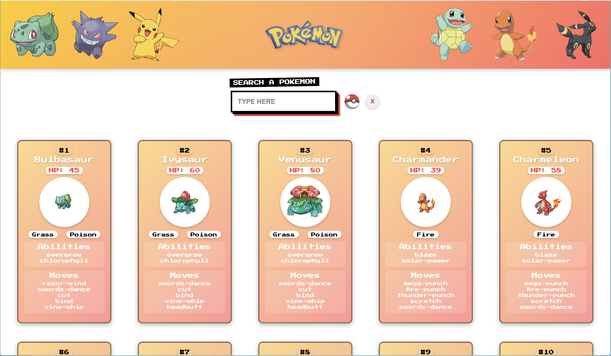

# Pokédex Project

A Pokédex application built with Angular, leveraging the PokéAPI to display Pokémon details including their stats, abilities, and moves.

## Features
- **List View:** Displays a paginated list of Pokémon.
- **Search Functionality:** Allows users to search for Pokémon by name.
- **Detailed View:** Shows detailed information about a selected Pokémon.
- **Responsive Design:** Optimized for different screen sizes.

## Technologies Used
- **Angular**: Component-based UI development
- **TypeScript**: Strongly typed JavaScript
- **PokéAPI**: Fetching Pokémon data
- **CSS**: Styling for UI elements

## Installation

1. Clone the repository:
   ```sh
   git clone https://github.com/lumab23/pokedex.git
   ```
2. Navigate to the project directory:
   ```sh
   cd pokedex
   ```
3. Install dependencies:
   ```sh
   npm install
   ```
4. Run the application:
   ```sh
   ng serve
   ```
5. Open the application in your browser:
   ```
   http://localhost:4200
   ```

## Screenshots


## Project Structure
```
/ src
  / app
    / components
      / card  --> Pokémon card component
      / list  --> Pokémon list component
      / search  --> Pokémon search component (credit: Uiverse.io by 0xnihilism)
      / header  --> Header with Pokémon logo
    / pages
      / home  --> Main homepage component
```

## API Usage
This project fetches Pokémon data from the [PokéAPI](https://pokeapi.co/).
- List of Pokémon: `https://pokeapi.co/api/v2/pokemon?offset={offset}&limit={limit}`
- Pokémon details: `https://pokeapi.co/api/v2/pokemon/{name}`

## Credits
- **Uiverse.io (0xnihilism)** for the search input design ([Design Link](https://uiverse.io/0xnihilism/calm-baboon-55)).

